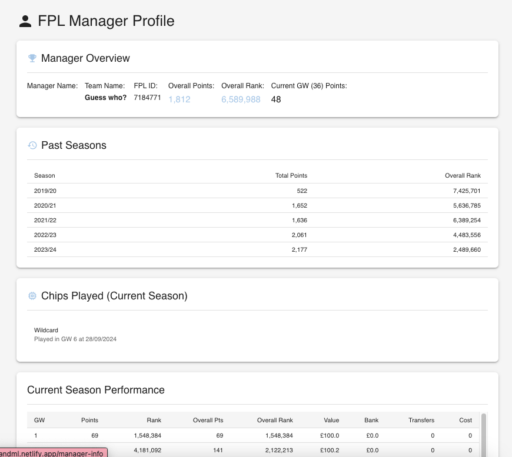
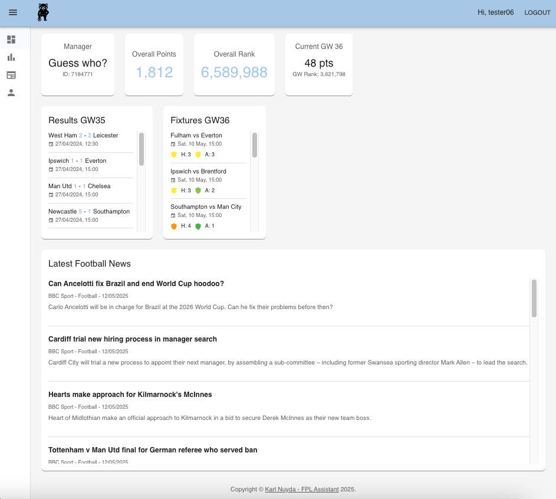
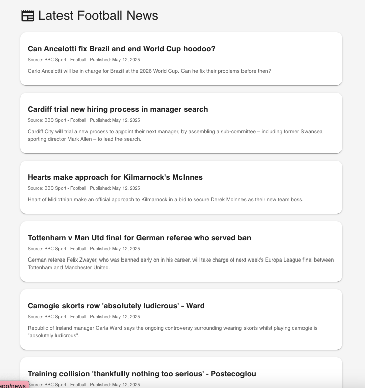
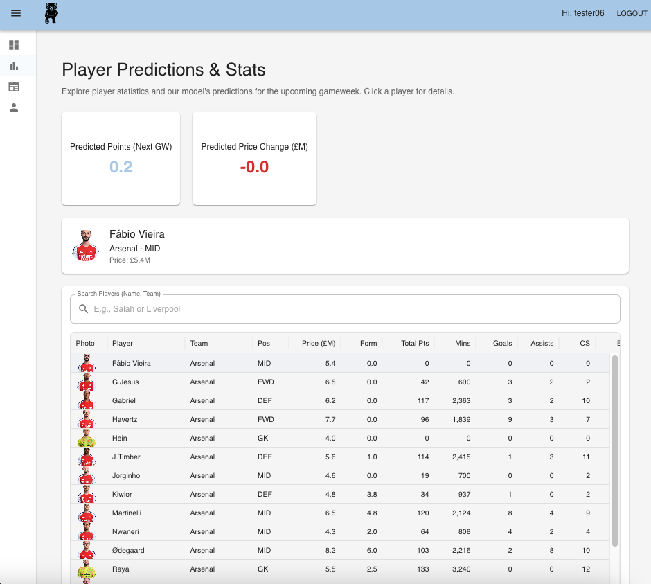

A2B: Fantasy Premier League Enhanced By Machine Learning

)
---

## Table of Contents

* [Project Overview](#project-overview)
* [Live Demo](#live-demo)
* [Key Features](#key-features)
* [Technology Stack](#technology-stack)
* [Architecture Overview](#architecture-overview)
* [Screenshots (Coming Soon!)](#screenshots)
* [Local Development Setup](#local-development-setup)
    * [Prerequisites](#prerequisites)
    * [Cloning](#cloning)
    * [Environment Variables](#environment-variables)
    * [Backend Setup (`a2b-app-backend`)](#backend-setup)
    * [Frontend Setup (`a2b-app-frontend`)](#frontend-setup)
    * [(Optional) ML Service Setup (`a2b-ml-service`)](#ml-service-setup)
* [Deployment](#deployment)
* [Known Limitations & Future Work (V3 Vision)](#known-limitations--future-work)
* [Author & Contact](#author--contact)

---

## Project Overview

The FPL Assistant Pro is a comprehensive full-stack web application designed to provide Fantasy Premier League (FPL) managers with data-driven insights, predictive analytics, and timely news to enhance their decision-making process. This project leverages a Python-based machine learning pipeline to generate player point and price change predictions, a robust MERN stack backend to serve data and manage users, and a dynamic React frontend for an engaging user experience. It also features an integrated news aggregation service (built with Node.js) to keep users updated on the latest football developments relevant to FPL.

This project was developed as a portfolio piece to showcase skills in data engineering concepts, machine learning integration, full-stack development (MERN), cloud deployment, and DevOps practices.

---

## Live Demo

* **Frontend Application (Netlify):** [YOUR_NETLIFY_FRONTEND_URL_HERE](https://fplandml.netlify.app/)
* **Backend API Base (Render):** [YOUR_RENDER_BACKEND_BASE_URL_HERE](https://a2b-mernapp.onrender.com)
    * *(Note: Most backend endpoints require authentication or are designed to be called by the frontend.)*

---

## Key Features

* **User Authentication:** Secure registration and login for personalized experiences.
* **Personalized Dashboard:**
    * Displays key FPL manager statistics (overall points, rank, current gameweek performance).
    * Integrated news feed with articles from multiple sources.
    * Widgets for previous gameweek results and upcoming fixtures.
* **Player Predictions Page:**
    * Data-rich, sortable, and searchable table of Premier League players with detailed stats.
    * Displays custom ML-generated predictions for "Next Gameweek Points" and "Price Change" prominently.
* **FPL Manager Info Page:** Detailed view of the logged-in user's FPL history, including past season performance, current season gameweek breakdown, and chips played.
* **News Feed Page:** A dedicated page for a more extensive view of aggregated football news.
* **Responsive UI:** Built with Material UI for a modern look and feel.

---

## Technology Stack

**1. Backend (`a2b-app-backend` - MERN Stack & Integrated Services):**
    * **Runtime:** Node.js
    * **Framework:** Express.js
    * **Database:** MongoDB (with Mongoose ODM) - *Hosted on MongoDB Atlas for deployed version.*
    * **Authentication:** JWT (jsonwebtoken) for tokens, bcryptjs for password hashing.
    * **API Communication:** `axios` for fetching data from external FPL APIs.
    * **News Aggregation:** Integrated Node.js service using `rss-parser` and `axios` to fetch and process RSS feeds, with in-memory caching.
    * **Data Validation:** `express-validator`.
    * **S3 Integration:** `@aws-sdk/client-s3` for fetching ML prediction outputs.

**2. Frontend (`a2b-app-frontend`):**
    * **Library/Framework:** React (with Vite for build tooling)
    * **UI Components:** Material UI (MUI) & MUI X (DataGrid)
    * **Routing:** React Router DOM
    * **State Management:** React Context API
    * **API Communication:** `axios`

**3. Machine Learning Pipeline (`a2b-ml-service` - Python-based, V1 Concept):**
    * **Language:** Python
    * **Core Libraries:** Pandas, Scikit-learn, Joblib, Requests, Boto3
    * **Functionality:** Automated ETL, feature engineering, model training (Decision Tree, RandomForestRegressor), prediction generation.
    * **Data Storage:** AWS S3 for storing trained models and prediction JSON files.
    * **Orchestration (Conceptual for V1):** Designed to be run as a scheduled AWS Fargate task.

**4. Cloud Infrastructure & Deployment:**
    * **Backend Hosting:** Render (deployed as a Dockerized Node.js service).
    * **Frontend Hosting:** Netlify (deployed as a static site from Vite build).
    * **Database Hosting:** MongoDB Atlas (cloud-hosted).
    * **ML Artifacts Storage:** AWS S3.
    * **Containerization:** Docker (for backend service).

---

## Architecture Overview

This project utilizes a frontend-backend architecture:

1.  **Frontend (React SPA):** Handles user interaction and presentation. Deployed on Netlify.
2.  **Main Backend API (Node.js/Express MERN):** Manages user authentication, serves data from MongoDB, interacts with the FPL API, serves ML predictions (fetched from S3), and includes the news aggregation logic. Deployed on Render.
3.  **ML Data Pipeline (Python - V1 Offline Process):** An automated batch process (conceptualized for V1) generates FPL player predictions. Its outputs (JSON files) are stored on AWS S3, which the main backend then accesses.

---

## Screenshots

